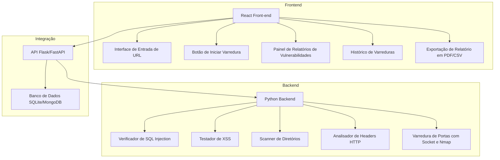
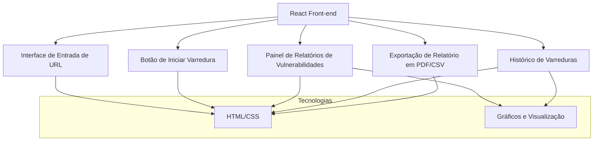
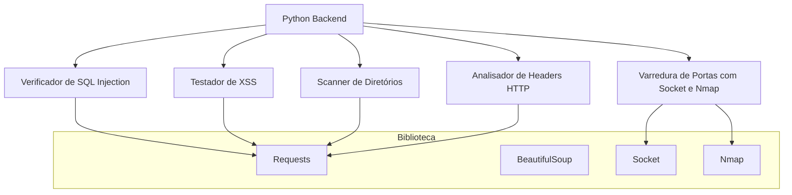

# WebGuard_Scanner
Ferramenta que verifica aplicações web em busca de vulnerabilidades comuns, como XSS, SQL Injection, diretórios expostos e configuração de headers de segurança.

## Projeto

## Front-end 

##  Back-end

### 1. Escopo do Projeto
Objetivo Principal: Criar uma ferramenta que verifica aplicações web em busca de vulnerabilidades comuns, como XSS, SQL Injection, diretórios expostos e configuração de headers de segurança.
Funcionalidades Extras: Possibilidade de varrer infraestrutura em busca de portas abertas, serviços vulneráveis, e coleta de informações (reconhecimento passivo).

### 2. Arquitetura do Projeto
- Back-end:

    - Python: Para a lógica principal do scanner.
Utilização de bibliotecas como requests, BeautifulSoup para fazer requisições e analisar respostas HTML.
    - Socket e nmap para varreduras de portas.
    - Módulos de Verificação:
Verificador de injeção de SQL.
Testador de Cross-Site Scripting (XSS).
Scanner de diretórios utilizando wordlists.
Analisador de headers HTTP para boas práticas de segurança.

- Front-end:

    - React: Para criar uma interface web onde o usuário possa inserir URLs, iniciar varreduras, e visualizar relatórios detalhados.
    - HTML/CSS: Para o layout básico.
    - JavaScript (Em analise): Para a interação do front-end com o back-end e gráficos simples.

- Integração:

    - API Flask ou FastAPI: Para expor o scanner via endpoints REST e possibilitar comunicação com o front-end.
    - Banco de Dados (opcional): Armazenar históricos de varreduras em um banco de dados leve como SQLite ou MongoDB para relatórios futuros.

### 3. Funcionalidades Planejadas
- Painel Principal: Interface para inserção de URL, início de varreduras e visualização de status.
- Relatórios: Exibição de vulnerabilidades encontradas com detalhes como tipo de falha, gravidade e recomendações de correção.
- Histórico: Tabela para consultar varreduras passadas.
- Exportação: Opção para exportar relatórios em PDF ou CSV.

### 4. Recursos Adicionais
- Scripts Shell: Para automatizar o processo de instalação de dependências e execução do projeto.
- Docker: Criar um contêiner que inclua todas as dependências necessárias para facilitar a implantação.