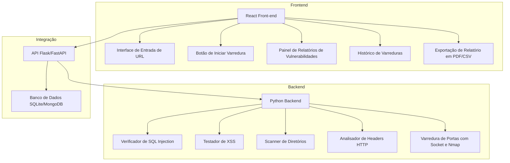
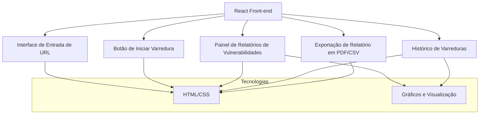
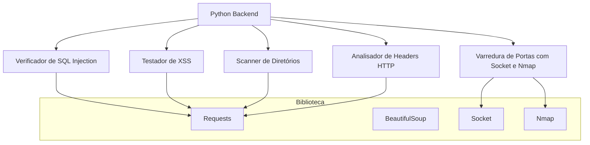

# WebGuard_Scanner
Ferramenta que verifica aplicações web em busca de vulnerabilidades comuns, como XSS, SQL Injection, diretórios expostos e configuração de headers de segurança.

## Projeto

## Front-end 

##  Back-end

